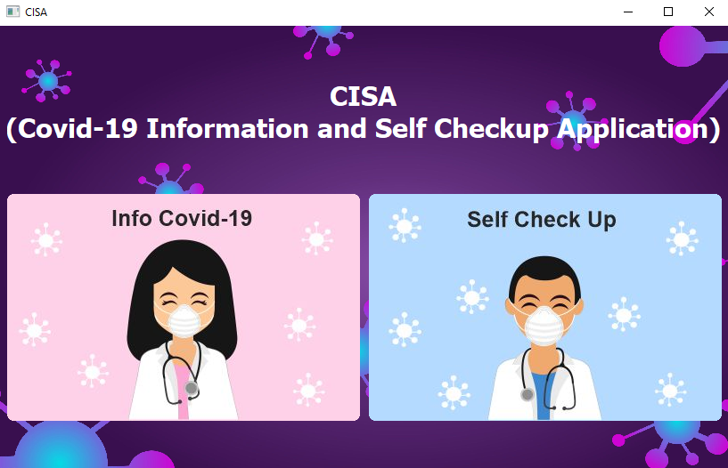

# CISA (Covid-19 Information and Self Check Up Application)
User can find out information about covid-19, referral hospitals, emergency contacts, and several tests that users can try to find out whether they have covid-19 or not.

This application is made using python and several libraries:
<ul>
  <li>PyQt5.QtCore</li>
  <li>PyQt5.QtWidgets</li>
  <li>PyQt5.QtGui</li>
</ul>
